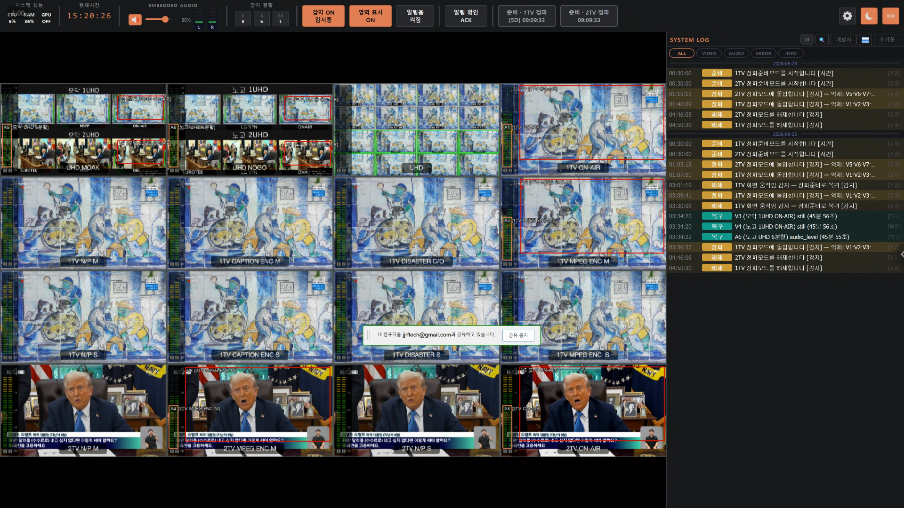
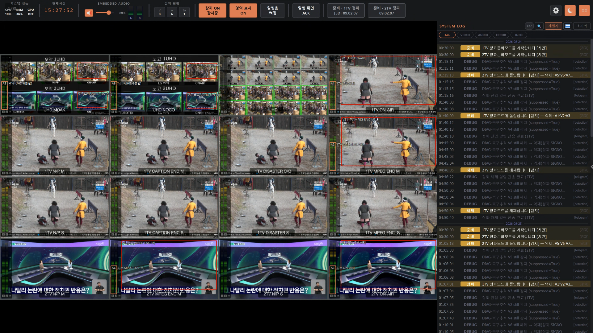
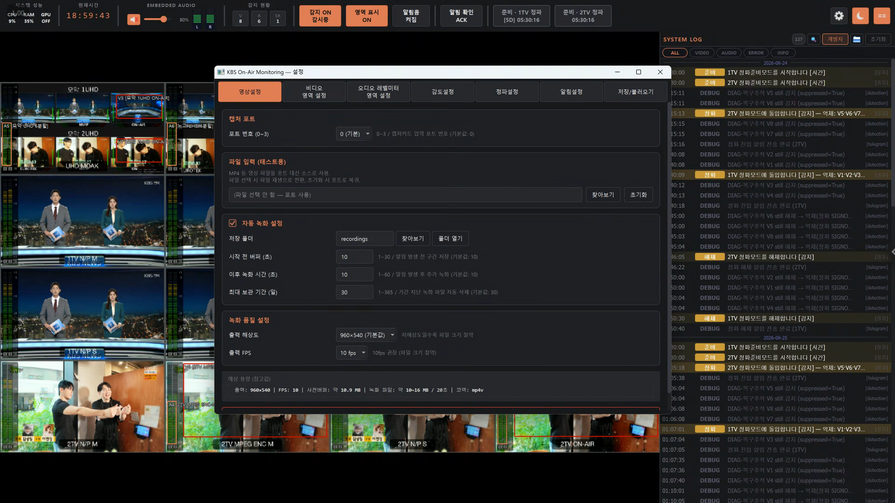
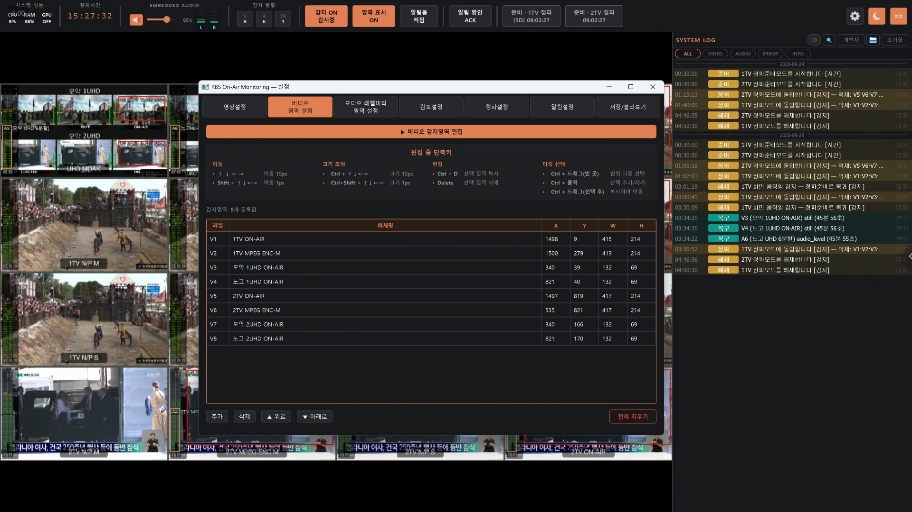
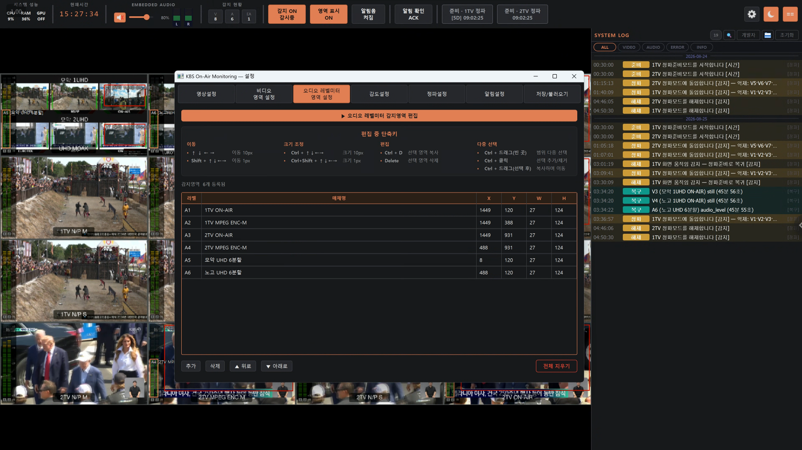
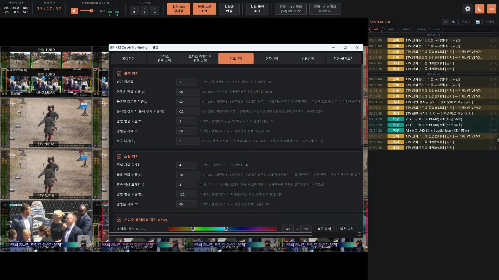
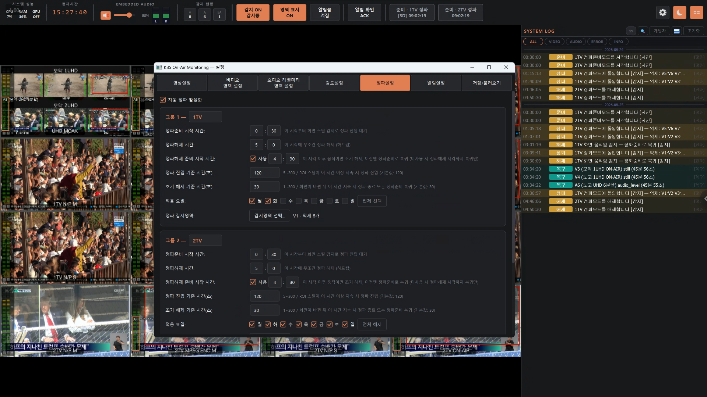
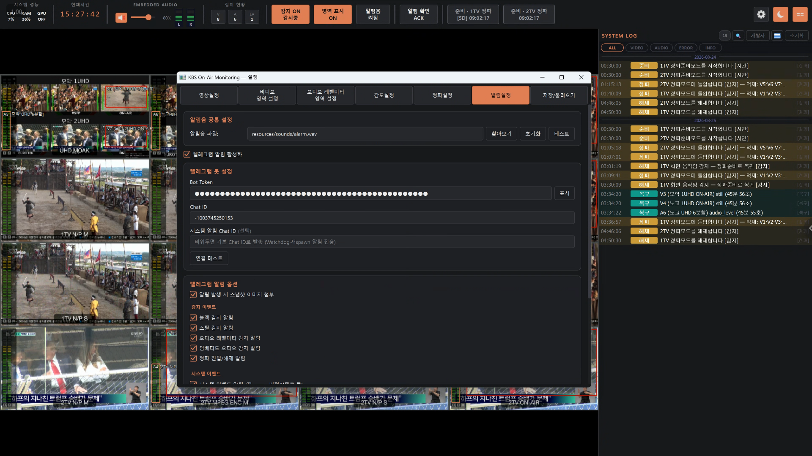
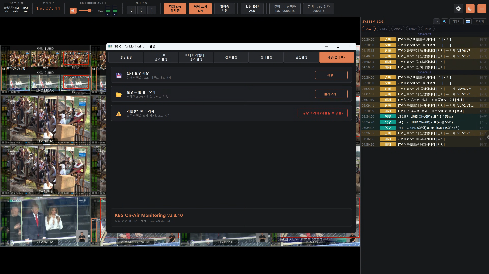

# KBS Monitoring v2

KBS 16채널 방송 모니터링 시스템 v2.

v1(KBS Peacock v1.6.x)의 핵심 문제인 **"장기 운영 시 감지 루프 freeze"** 를 근본 해결하기 위해 multiprocessing 기반으로 완전 재작성했습니다. UI 프로세스와 Detection 프로세스를 분리하여 감지 루프가 UI 이벤트의 영향을 받지 않습니다.

---

## 주요 기능

- **16채널 동시 모니터링** — 블랙·스틸·오디오레벨·임베디드 오디오 감지 (HSV 포함)
- **히스테리시스 기반 경보** — 오탐 방지를 위한 진입/복구 타이머 대칭 적용
- **정파 자동 감지 및 억제** — PREPARATION·SIGNOFF 상태 전환, 그룹별 억제 적용
- **Watchdog 자동 복구** — Detection 크래시 시 10초 내 재spawn + UI 상태 자동 복원
- **텔레그램 알림 이중화** — 감지 이벤트(Detection)와 프로세스 생존(Watchdog) 발송 주체 분리
- **순환버퍼 자동 녹화** — pre-roll 포함 MP4, ffmpeg으로 임베디드 오디오 합성
- **7탭 설정 다이얼로그** — 채널·감지·알림·녹화·정파·텔레그램·시스템 설정

---

## 스크린샷

### 메인 모니터링 화면

16채널 실시간 그리드와 시스템 로그를 한 화면에서 확인합니다. 감지된 채널은 빨간 테두리,
정파 채널은 회색 처리됩니다.



디버그 모드에서는 시스템 로그에 억제(suppress) 판단 근거까지 상세히 기록됩니다.



### 설정 다이얼로그

<details>
<summary>7탭 설정 다이얼로그 스크린샷 펼치기</summary>

**영상 설정** — 캡처 포트, 자동 녹화(pre-roll·보관 기간), 녹화 해상도/FPS를 설정합니다.



**비디오 영역 설정** — 채널별 감지 영역(ROI)을 좌표로 편집합니다.



**오디오 레벨미터 영역 설정** — 임베디드 오디오 레벨미터 감지 영역을 등록합니다.



**감도 설정** — 블랙·스틸·오디오레벨미터(HSV) 감지 임계값을 채널 그룹별로 조정합니다.



**정파 설정** — 그룹별 정파준비·정파해제 시각과 요일, 정파 진입 억제 영역을 지정합니다.



**알림 설정** — 텔레그램 봇 연동과 이벤트별 알림 발송 여부를 설정합니다.



**저장/불러오기** — 설정을 JSON으로 내보내거나 불러오고, 버전 정보를 확인합니다.



</details>

---

## 아키텍처

```
main.py  (UI 프로세스 + Launcher)
  ├─ SharedMemory 생성·잔존 정리
  ├─ result_queue / cmd_queue / shutdown_event 생성
  ├─ Watchdog Process spawn
  └─ QApplication + MainWindow 실행

UI Process (PySide6 이벤트 루프)
  ├─ UIBridge (QThread)          result_queue 폴링 → Qt Signal 변환
  ├─ SharedFramePoller (QTimer)  ~33ms, seq_no 변경 시 프레임 갱신
  ├─ AlarmSystem                 시각/청각 알림 + Ack 상태 관리
  └─ DetectionReady 수신 시      런타임 상태 재주입 (설정·ROI·볼륨 등)

Watchdog Process
  ├─ heartbeat.dat 감시          10초 무응답 → Detection kill 후 재spawn
  ├─ UI 생존 감시                30초 주기 psutil — 사망 시 Detection 정리 후 자신 종료
  └─ 텔레그램 직접 발송          [SYSTEM] prefix — Detection이 죽어도 알림 보장

Detection Process  (PySide6 임포트 없음)
  ├─ VideoCaptureWorker          threading.Thread
  ├─ AudioMonitorWorker          threading.Thread, sounddevice 단독 소유
  ├─ DetectionEngine             블랙/스틸/HSV/임베디드
  ├─ SignoffManager              threading.Thread, 정파 상태 관리
  ├─ AutoRecorder                순환버퍼 + ffmpeg
  ├─ TelegramWorker              [DETECT] 감지 이벤트 알림
  └─ HeartbeatWriter             5초 주기 heartbeat.dat 갱신
```

### 프로세스 간 통신

| 채널 | 방향 | 용도 |
|------|------|------|
| SharedMemory `kbs_frame_v2` | Detection → UI | 프레임 픽셀 (~6 MB) |
| SharedMemory `kbs_state_v2` | 양방향 | detection_enabled, mute, volume, L/R 레벨미터 |
| `result_queue` (maxsize=200) | Detection → UI | 감지결과, 알림이벤트, 로그, DIAG |
| `cmd_queue` (maxsize=50) | UI → Detection | 설정변경, ROI업데이트, 정파명령 |

---

## 설치

### 필수 패키지

```bash
pip install PySide6 opencv-python numpy sounddevice psutil gputil pycaw requests
```

| 패키지 | 미설치 시 동작 |
|--------|--------------|
| `sounddevice` | 더미 오디오 신호로 동작 |
| `gputil` | GPU 항목 N/A 표시 |
| `pycaw` | 시스템 볼륨 제어 불가 |

### ffmpeg (자동 녹화 오디오 합성용)

```bash
winget install ffmpeg
```

미설치 시 비디오 전용 MP4로 폴백합니다 (에러 아님).

---

## 실행

`실행.bat` 더블클릭 (권장). 예약 재시작 시 자동 재가동(종료코드 42 → 배치 루프 재실행)이
이 래퍼를 통해서만 동작하므로 운영 환경에서는 반드시 `실행.bat` 으로 실행한다.

```bash
# 직접 실행도 가능하나 예약 재시작 자동 재가동은 동작하지 않음
python main.py
```

---

## 개발 현황

| Phase | 내용 | 상태 |
|-------|------|------|
| 0-A | 저장소 초기화 + 설계 문서 확정 | ✅ 완료 |
| 0-B | 패키지 골격 + IPC 정합성 테스트 | ✅ 완료 |
| 1 | Detection 프로세스 독립 실행 + 단위테스트 33개 | ✅ 완료 |
| 2 | UI 프로세스 + IPC 연결 + 다크 테마 | ✅ 완료 |
| 3 | 알림 + 정파 + ROI 편집 + 설정 다이얼로그 | ✅ 완료 |
| 4 | Watchdog + Launcher 완성 + 예약 재시작 | ✅ 완료 |
| 5 | 통합 검증 (DIAG 완성 + 버퍼 상한) | 🔄 진행 중 |

---

## 파일 구조

```
kbs_monitoring_v2/
├── main.py                       # Launcher (faulthandler + sys.excepthook + cwd 고정)
├── processes/
│   ├── detection_process.py      # Detection 프로세스 진입점
│   └── watchdog_process.py       # Watchdog 프로세스
├── ipc/
│   ├── shared_frame.py           # SharedMemory 프레임 버퍼
│   ├── shared_state.py           # SharedMemory 상태 버퍼
│   └── messages.py               # Queue 메시지 dataclass
├── detection/                    # Detection 전용 모듈 (PySide6 없음)
├── ui/                           # PySide6 UI 모듈
├── core/
│   └── roi_manager.py            # ROI dataclass + 관리
├── utils/
│   ├── config_manager.py         # JSON 설정 저장/로드
│   └── logger.py                 # 프로세스별 파일 로그
└── config/
    └── default_config.json
```

---

## 요구 환경

- Python 3.11+
- Windows 10/11
- NVIDIA GPU (선택, gputil 사용 시)
- 오디오 캡처 카드 / 비디오 캡처 카드
